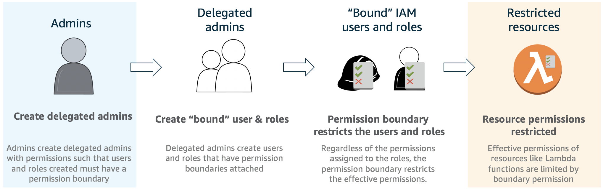
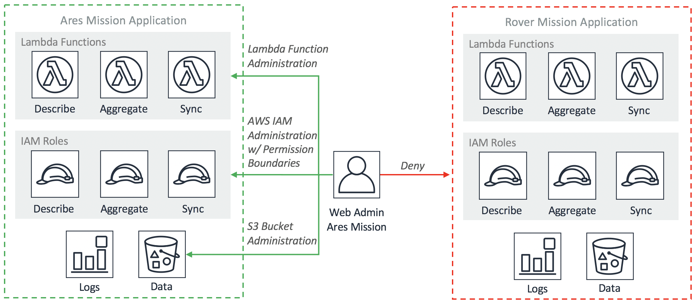

# Permission Boundaries: How to Truly Delegate Permissions on AWS (Build Phase)

As your organization grows the ability to delegate permission management to trusted employees becomes important to scaling successfully. Permission boundaries addresses a longstanding customer issue, namely, how do I delegate administration to my users. If you need to assign your system administrators the ability to create IAM roles and users, developers that need to be able to create roles for Lambda functions, or any similar scenario, in a controlled manner then you need permission boundaries.

## Scenario

As the administrator for an AWS account hosting multiple production applications, you've been tasked with creating a new administrator role to delegate some of your responsibilities.  This new role will be responsible for doing all the administration on the resources for the **Ares Mission**.  The diagram above showcases the two applications currently being hosted in the AWS account and their associated resources. Currently there is one application but additional applications are planned.  The new role should account for current and future Ares Mission applications to reduce your overhead and friction with the web administrators.

The web administrators for the Ares Mission should have permissions to create and administer resources related to that mission.  This means they should be able to:

1. Create, modify, and delete IAM policies and roles.  Any role created must have restricted permissions to ensure a web administrator cannot elevate their privileges or the privileges of the application.
2. Create, modify, and delete Ares Mission Lambda functions.

The web administrators should not be able to impact any resources in the account that are not part of the Ares Mission application including users, groups, roles, S3 buckets, EC2 instances, etc.  In this case, they should not be able to modify resources of the Rover Mission.